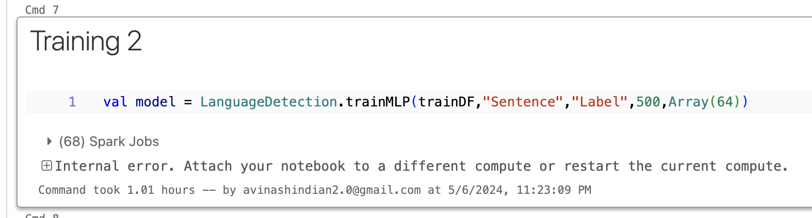

# SparkMachineTranslation
Machine translation with Apache spark 


## Introduction 
The SparkMachineTranslation project aims to demonstrate the feasibility of large-scale machine translation using Apache Spark. This README provides an overview of the project's design details, focusing on two main tasks: Language Prediction and Language Translation.

## Design Details

In this project we explore the task of large scale machine translation.  The primary goal of this project is to show the feasibility of this challenge. We break this into two task. 
- Language Prediction 
- Languege Translation 


## Language detection 
Language prediction involves identifying the language of a given text. This task is essential for handling multilingual data efficiently. In this project, we utilize Apache Spark's distributed computing capabilities to analyze large volumes of text data. In many data processing applications bring data from different geographic regions to one compute resource for batch processing is a norm. Such data may contains different language text in the same field. i.e in a tabular structured data, same column might contain text from different languages. Our first goal is accurately detect the input text language and annotate those rows with appropriate tags. Then Find all the distinct tags and load the necessary translation models into memory and perform machine translation

## Language translation 
Language translation is the process of converting text from one language to another. In the context of this project, we leverage Apache Spark for scalable translation tasks. By distributing the translation workload across multiple nodes, we demonstrate the ability to handle translation tasks at a large scale effectively.

# Technical details

## Datasets 
- For language detection we use 'wili-2018' dataset from from HuggingFace , contains senteces from 235 different languages

## Language detection workflow 
- Proprocess the dataset 
- - Removing numerical characters
- - converting to uppercase(not necessary)
- - tokenization ( Custom tokenizer is used with 6 as window size and 3 as stride) 
- - Hashing Term Frequency algorithm is used to convert tokens into vectors ( Buckenting dimension is chosen to be 2000-4000 in testing), for 3-4 languages even 512 works 
- - Normalizer with L1 norm is used to convert token frequencies
- These vectors are fed into Multilayer Perceptron model in Spark ML lib [Input Dimension = Buckenting dimension , Output Dimension = NUMBER OF SUPPORTED LANGUAGES + 1]
- - Here I used UNKOWN as a code for languges that come outside the choice of supported languages 
**Hyperparameter tuning** 
```
val HashingDimension = 2048
setStepSize(0.05).setSeed(1234L).setMaxIter(1000) 

\\for tokenizations
Windowsize = 6, 
Stride = 3
```

## Language translation workflow 
- Use the stored/ existing language detection model 
- Retrive all the different languages in the input Batch data
- Load the models one by one , Checkpoint the dataset after tranlation every 10 languages [ heavy on memory in the worst case]


## Installation
```
git clone https://github.com/PJAvinash/SparkMachineTranslation.git
```


## Setting Up spark local machine (for testing)
- visit https://dlcdn.apache.org/spark/spark-3.5.1/spark-3.5.1-bin-hadoop3.tgz
- machine requires java installed 
- ```echo $SPARK_HOME``` should be set to " ..../spark-3.5.1-bin-hadoop3" in .zshrc/.bashrc files (for mac/linux)

## Compilation 
```
cd SparkMachineTranslation/project

sbt compile

sbt package
```

## Execution 
```
spark-submit <JAR File path>
```
**For example**
```
spark-submit <parent directory>/SparkMachineTranslation/project/target/scala-2.12/sparkmachinetranslation_2.12-0.1.jar
```
## Resources 
- https://github.com/JohnSnowLabs/spark-nlp
- https://github.com/JohnSnowLabs/spark-nlp/tree/master/examples
- https://www.scaler.com/topics/tensorflow/tensorflow-transformer/
- https://fasttext.cc/docs/en/crawl-vectors.html
- https://github.com/eaplatanios/tensorflow_scala
- https://sparknlp.org/api/com/johnsnowlabs/nlp/annotators/seq2seq/MarianTransformer


## some challenges and results
- Yes

- But ( Training required heavy compute)



## Acknowledgment
We acknowledge the Apache Spark community for providing the powerful framework that enables scalable machine translation and language processing tasks, As well as JohnSnowLabs for supporting start of the art NLP techniques in such a widely use distribute processing framework. 

Also, my NLP instructor Prof. Tatiana Erekhinskaya for allowing me to go though this challenge!


## Contributors
- PJ Avinash

## Remarks 
This Project's main goal to demonstrate for those who would like to design large scala data processing systems that require NLP in the pipeline. You can start picking ideas from here.
